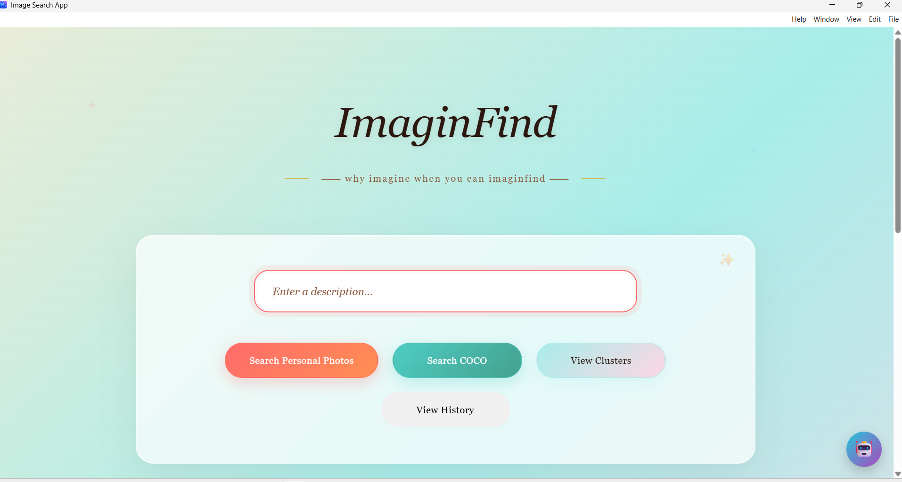
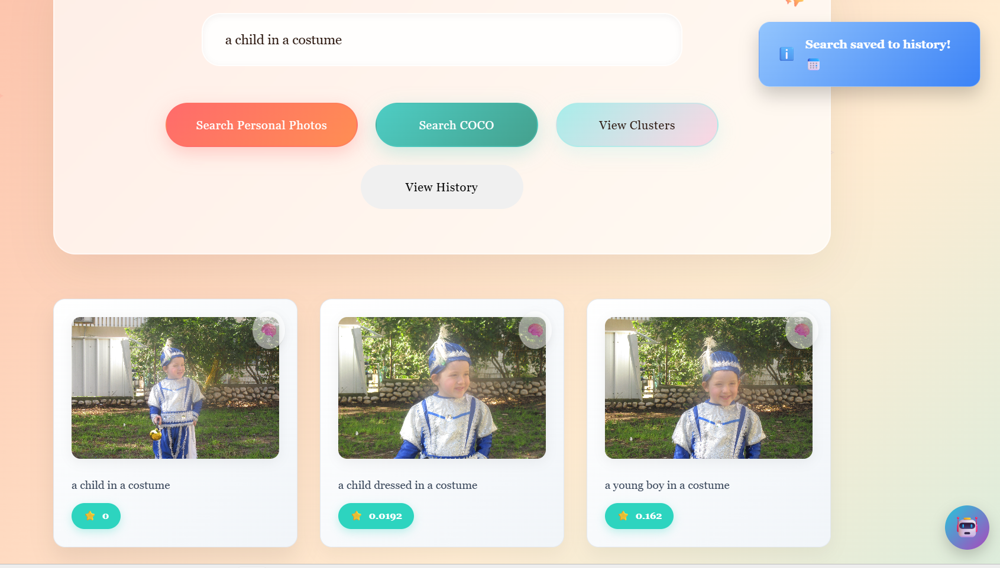
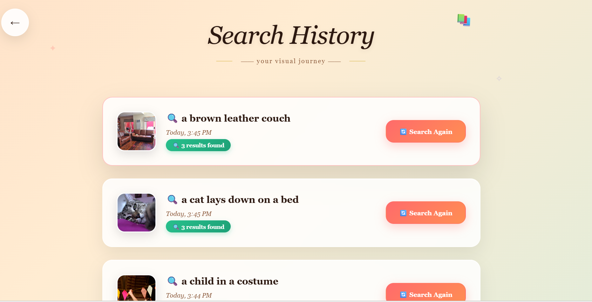

# imaginFind – AI-Powered Personal & COCO Image Search 🔍

**imaginFind** is an AI-based image search application that allows users to search both their **personal image gallery** and the **COCO dataset** using natural language queries. The system works offline, with automatic caption generation, semantic similarity search, search history, and optional image clustering.

---

## 🚀 Features

- 🖼️ **Search in Personal Images** – Upload and search your own gallery  
- 🧠 **COCO Dataset Search** – Find images from the popular COCO dataset  
- 📝 **Offline Captioning** – Uses BLIP2 to generate image captions locally  
- 🔍 **Semantic Search** – Uses Word2Vec for text-to-image similarity  
- 🗂️ **Image Clustering** – Group images by topics  
- 🕓 **Search History** – Save and re-run previous searches  
- 📐 **Angle Similarity Visualization** – See how close images are to the query  
- 💬 **Offline Chatbot** – Ask questions about the system


---

## 🧠 AI Modules Used

| Module                | Purpose                                                     |
|-----------------------|-------------------------------------------------------------|
| **BLIP2**             | Generates captions for images to create semantic embeddings |
| **MiniLM**   | Measures similarity between cluster names   |
| **Word2Vec**          | Embeds user text queries for semantic similarity            |
| **Logistic Regression** | Custom-trained classifier to predict image categories prior to clustering |
| **KMeans**            | Clusters images within predicted categories                  |
| **PGVector**          | Stores image embeddings for efficient similarity search      |

---

## 🛠️ Tech Stack

| Area     | Technology Used                        |
|----------|----------------------------------------|
| Backend  | Python (FastAPI), SQLite               |
| AI       | Transformers, scikit-learn, Faiss      |
| Frontend | HTML, CSS, JavaScript (Electron-ready) |
| Tools    | Pillow, Uvicorn, Pydantic      |

---

## 📁 Project Structure
```
imaginFind/
├── server/ (FastAPI - Python)
│   ├── routes/              # API endpoints
│   ├── services/            # Search logic, embeddings, clustering
│   └── db/                  # Database connection & models (PostgreSQL + pgvector)
├── models/ (AI Models)
│   ├── blip2/               # BLIP2 image captioning model
│   ├── word2vec/            # Word2Vec embedding model
│   └── classifier/          # Trained clustering model (e.g., Logistic Regression)
├── client/ (Frontend)
│   ├── index.html           # Main UI page
│   ├── history.html         # Search history page
│   ├── chat.html            # Chat interface
│   ├── renderer.js          # JS logic
│   └── style1.css           # Styles
├── screenshots/             # UI Screenshots for README / documentation
│   ├── home.png
│   ├── search.png
│   ├── clusters.png
│   └── history.png
└── README.md                # Project documentation

```


---

## 📷 Screenshots

### 🔍 Home Page  


### 🧠 Search Results  


### 🗂️ Cluster View  


### 📜 Search History  


---

## 🧪 Example Use Case

1. User uploads personal images.  
2. The system generates captions for each image using BLIP2.  
3. User types: `"a person riding a bike"`  
4. Word2Vec compares the query with all image captions.  
5. Results are ranked and shown with angle similarity.  
6. User can view relevant clusters.  
7. The search is saved in the history for reuse.

---

## 📦 Installation

Clone the repository:

```bash
git clone https://github.com/michal1-1/imaginFind.git
cd imaginFind

cd server
python -m venv venv
source venv/bin/activate  # On Windows: venv\\Scripts\\activate
pip install -r requirements.txt
uvicorn main:app --reload

cd client
# Open index.html in browser or run with Electron

```
---

## 🌟 Future Improvements
**🌐 Multi-language support (Hebrew, Arabic, more)**

**📱 Mobile version with live camera input**

**🖼️ Visual-only search (no text needed)**

**📊 Admin dashboard and image analytics**


## 🎥 Project Presentation

Watch the full presentation on [Canva](https://www.canva.com/design/DAGpkisJr9Q/ofLCqvlnQPimFWSgXpRNsg/edit?utm_content=DAGpkisJr9Q&utm_campaign=designshare&utm_medium=link2&utm_source=sharebutton)
